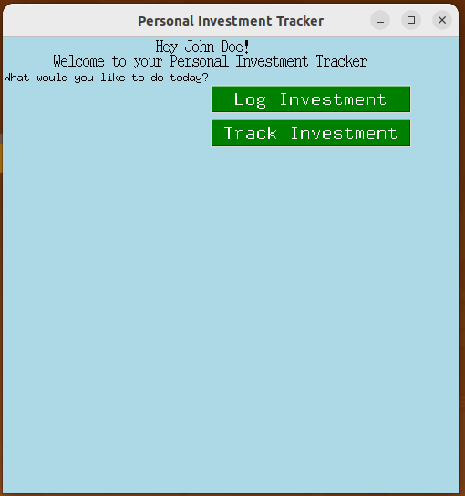

# Personal Investment Tracker App



## Overview

This is a simple Personal Investment Tracker app built using Python and the Tkinter library for the graphical user interface. The app allows users to track and log their various investments, including details such as investment type, subtype, and specific investment details.

## Features

- **User Welcome Screen:** Allows users to enter their name and email to create a personalized experience.
- **Main Dashboard:** Displays a personalized welcome message and provides options to either track or log investments.
- **Investment Tracking:**


Enables users to select an investment type, choose a specific investment, and track relevant details.
- **Investment Logging:** 


Allows users to log new investments with specific details based on the selected investment type.

## How to Run the App

1. Ensure you have Python installed on your system.
2. Clone the repository to your local machine.
3. Open a terminal and navigate to the project directory.
4. Run the following command to launch the app:

   ```bash
   python3 -m venv invest
    source invest/bin/activate
   ```
5. Run the following command to install the required dependencies:

   ```bash
   pip install -r requirements.txt
   ```

6. Run the following command to launch the app:

   ```bash
   python test_main.py
   
### Databases

The app uses a SQLite database to store user information and investment details. The database is created and initialized when the app is first launched. The database is stored in a file named `investments.db` in the project directory.

## TODO List

- Add the ability to edit and delete investments.
- Implement data visualization to display investment trends and performance.
- Add the ability to set investment goals and track progress.
- Implement user authentication and account management features.
- Add support for multiple users and data segregation.
- Implement data backup and restore functionality.
